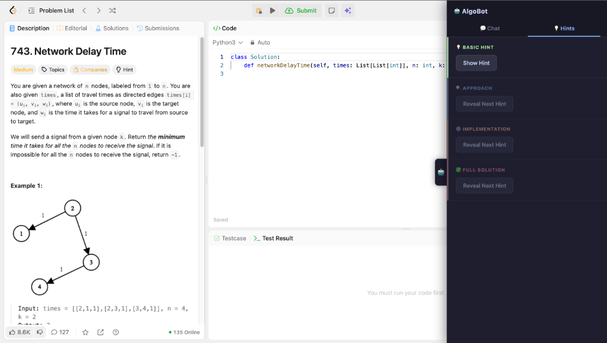
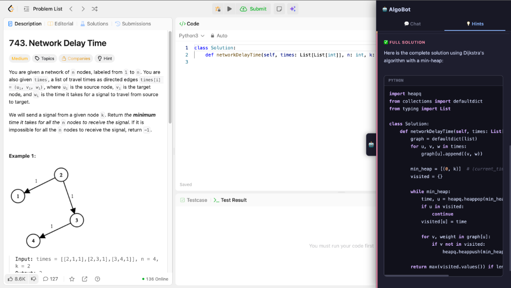
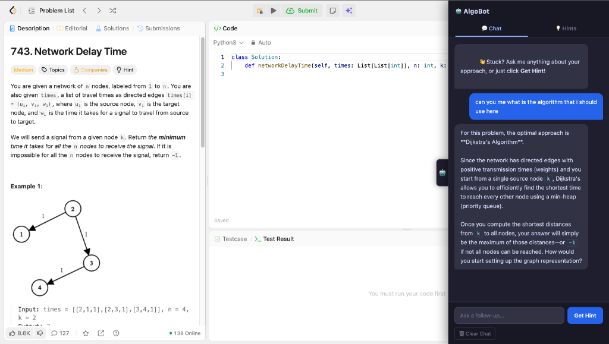
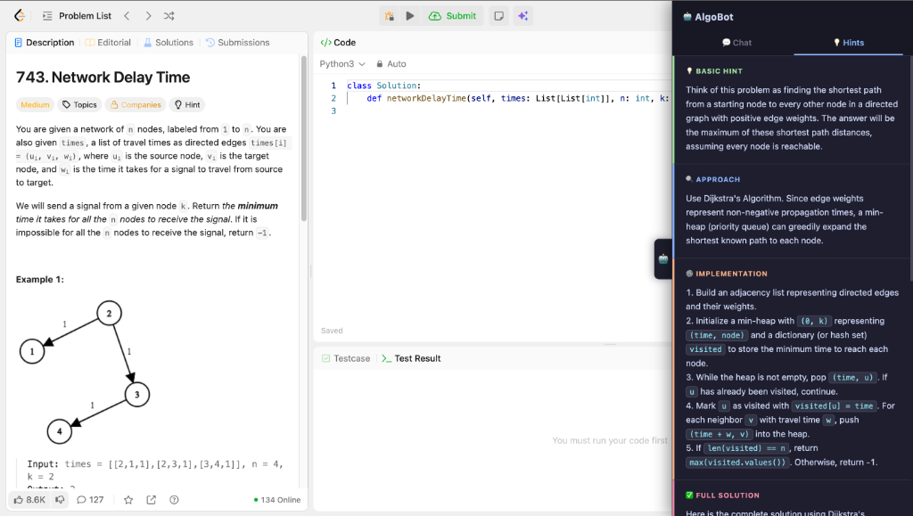

# AlgoBot — AI Pair Programmer for LeetCode & NeetCode

A Chrome extension that embeds a smart AI assistant directly into LeetCode and NeetCode problem pages. Get progressive hints, chat about your approach, or reveal a full solution — all without leaving the tab.

   

---

## Features

**💬 Chat** — Ask anything about your approach. AlgoBot reads the problem and your current code so you don't have to copy-paste anything.

**💡 Hints** — Four progressive hint levels revealed one at a time:
- **Basic Hint** — nudge in the right direction
- **Approach** — algorithm / strategy
- **Implementation** — step-by-step breakdown
- **Full Solution** — complete working code with syntax highlighting

**🎨 Syntax Highlighting** — Code blocks are rendered with proper colors for Python, JavaScript, Java, and C++.

**🔄 Model Fallback** — If Gemini is overloaded, you can retry with an alternate model without losing context.

---

## Screenshots









---

## Installation

### Load the Extension (no build step needed)

1. Clone the repo:
   ```bash
   git clone https://github.com/Manivardhan23/algobot-chrome-extension.git
   ```
2. Open Chrome and navigate to `chrome://extensions`
3. Enable **Developer Mode** (toggle in the top-right)
4. Click **Load Unpacked** and select the `algobot-extension/` folder

The extension connects to a hosted backend automatically — no server setup required.

---

## Local Development (Optional)

To run your own backend instead of the hosted one:

```bash
cd server
cp .env.example .env
# Add your key from https://aistudio.google.com/apikey
# GEMINI_API_KEY="your_key_here"

uv run main.py
```

Then update the API URL in `content.js` to point to `http://127.0.0.1:8000`.

> **Getting a free Gemini API key:** Go to [Google AI Studio](https://aistudio.google.com/apikey), sign in, and click **Create API Key**. The free tier provides 1,500 requests/day.

---

## How It Works

AlgoBot injects a sidebar panel directly into the LeetCode/NeetCode UI. When you interact with it:

1. `content.js` captures the problem title, description, and your current code from the Monaco/CodeMirror editor via `inject.js`
2. This context is sent to a FastAPI backend (`server/api.py`)
3. The backend calls the Gemini API and streams the response back
4. The sidebar renders the response with syntax-highlighted code blocks

---

## Project Structure

```
algobot-extension/
├── manifest.json       # Chrome Extension config (Manifest V3)
├── content.js          # Injects the sidebar UI + handles all interactions
├── inject.js           # Reads live code from the Monaco/CodeMirror editor
├── background.js       # Extension service worker
├── styles.css          # Sidebar styles
├── popup.html          # Extension icon popup
└── server/
    ├── api.py          # FastAPI backend — calls Gemini API
    ├── main.py         # Server entry point
    ├── pyproject.toml  # Python dependencies (managed by uv)
    └── .env.example    # API key template
```

---

## Tech Stack

| Layer | Tech |
|---|---|
| Chrome Extension | Manifest V3, Vanilla JS |
| Backend | Python, FastAPI, uvicorn |
| AI Model | Google Gemini Flash (free tier) |
| Package Manager | [uv](https://astral.sh/uv) |

---

## License

MIT — free to use, modify, and share.
